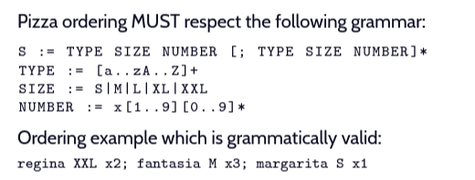

# The-Plazza

## A pizzeria simulation in C

The purpose of this project was to simulate how a pizzeria can work with the possibility of taking differents orders simultaneously.
Handling multiple kitchens creating gradually with multiple cooks inside them being available or not.

## Usage

``` zsh
make
./plazza <cookingTime> <cooksNumber> <refillTime>
```

- When the program is running, you can order pizza(s) with specific commands, look below for help


